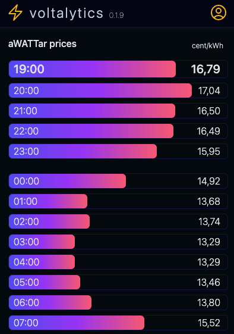

# Voltalytics

Voltalytics is an open-source project designed to display real-time electricity prices from the electricity provider [aWATTar](https://www.awattar.com). With a user-friendly dashboard, users can quickly view an overview of electricity prices for the next hours, and access a more detailed list of prices with a simple click. In the future, the dashboard will be extended to display API data from a [Sofar Solar Inverter](https://www.sofarsolar.com).

> prices are displayed in **_euro cent / kWh_** including 20% vat

## Features

- Dashboard with an overview of electricity prices for the next hours.
- Detailed list of prices accessible with a single click.
- Profile page with google login
- Possibility to store SolarMan API credentials
- Display of SolarMan realtime data in dashboard 

## Techstack

- [Next.js 13](https://beta.nextjs.org/docs)
- [Tailwind CSS](https://tailwindcss.com/)
- [chartJS](https://www.chartjs.org)
- [Vercel](https://vercel.com) (hosting)
- [Supabase](https://supabase.io) (database)
- [aWATTar API](https://www.awattar.at/services/api)
- SolarMan API

## Screenshots

Dashboard (light)  

Dashboard (dark)  

PriceChart (light)  

PriceChart (dark)  

Profile (light)

Profile (dark)

